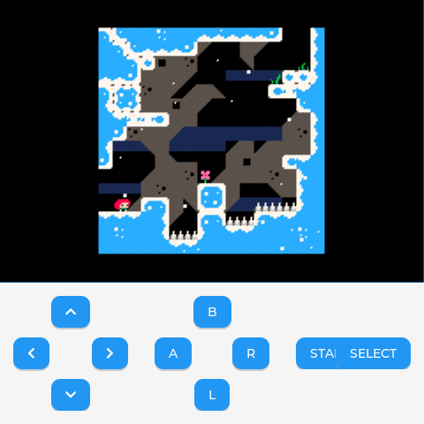
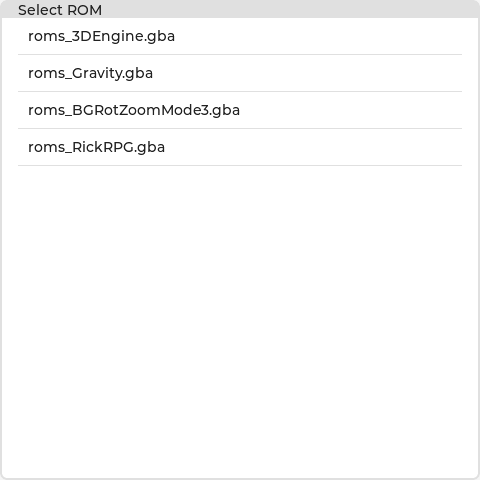
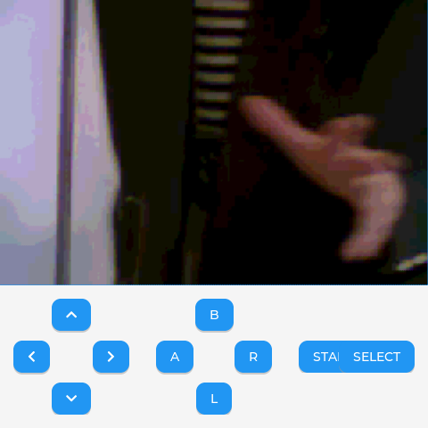
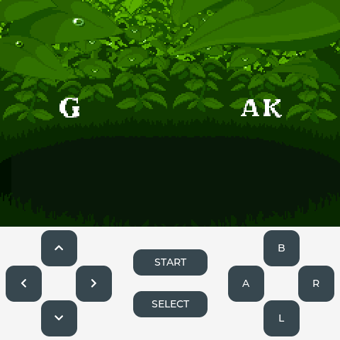

# eMP-gba

GBA 模拟器（Allwinner T113-S3 / TinaLinux，480×480 屏）。

LVGL v9.4.0 UI + vba-next（libretro GBA 内核）+ ALSA 音频输出。

## 特性

- GBA 原生 240×160，等比放大 2 倍到 480×320，顶部居中显示
- 底部 480×160 区域放置虚拟按键（十字键 / A B L R / START SELECT，布局参考 lv_gba_emu）
- ALSA 音频输出（PCM `default`，S16_LE 双声道），音量 0-100，可关闭
- ROM 选择菜单（扫描目录下 `*.gba`），SELECT 长按 2 秒保存存档并返回菜单
- 多点触控输入（Goodix 触摸屏，2 个独立指针 indev），可**双指同时按下两个虚拟键**（如 ↑+A、L+R）

## 目录结构

```
eMP-gba
├── CMakeLists.txt                # 构建主入口（CMake）
├── main.cpp                      # 入口：HAL::Init + Page::Model + 空闲主线程
├── build.sh                      # 交叉编译快捷脚本（T113-S3）
├── cmake/
│   └── build_for_t113s3.cmake    # T113-S3 交叉编译工具链文件
├── inc/                          # HAL.h / Model.h / View.h / common_inc.h
├── src/
│   ├── HAL/HAL.cpp               # fbdev + evdev + POSIX FS 初始化
│   ├── Page/Model.cpp            # GBA 生命周期 + LVGL 线程
│   ├── Page/View.cpp             # 菜单 / 模拟器 UI 的 C++ 封装
│   ├── gba_core/                 # lv_gba_emu 移植层（视图 / 菜单 / libretro 桥）
│   └── gba_port/                 # T113 端口（ALSA 音频、POSIX FS、port 桩）
└── libs/
    ├── lvgl                      # submodule：LVGL v9.4.0
    ├── vba-next                  # submodule：FASTSHIFT/vba-next（libretro GBA core）
    └── lv_conf.h                 # LVGL 配置（480×480 RGB565 / fbdev / evdev）
```

## 依赖

- 交叉编译工具链 [eMP-toolchain](https://github.com/ZhangKeLiang0627/eMP-toolchain)
  （GCC 6.4.1 musl，ARMv7-A / Cortex-A7）
- submodule：
  - `libs/lvgl` → [lvgl/lvgl](https://github.com/lvgl/lvgl) @ v9.4.0
  - `libs/vba-next` → [FASTSHIFT/vba-next](https://github.com/FASTSHIFT/vba-next) @ `a5e0d8ad`（与 lv_gba_emu 一致的钉定版本，含 `gba_set_rom_size`）

## 构建

```sh
git clone --recursive https://github.com/ZhangKeLiang0627/eMP-gba.git
cd eMP-gba

# 方式一：build.sh
T113_SDK=/path/to/eMP-toolchain ./build.sh

# 方式二：直接 CMake
cmake -B build \
      -DCMAKE_TOOLCHAIN_FILE=cmake/build_for_t113s3.cmake \
      -DT113_SDK=/path/to/eMP-toolchain
make -C build -j$(nproc)
```

产物：`build/eMP_gba`（ARM 可执行文件）。

## 运行（T113-S3 板端）

```sh
# 环境变量（可选）
export EMP_GBA_ROM_DIR=/root/roms    # ROM 目录，默认 /root
export EMP_GBA_VOLUME=100            # 音量 0-100，0 关闭音频
export EMP_GBA_AUTOSTART=/root/roms/xxx.gba   # 启动后直接进入指定 ROM（跳过菜单）
export LV_GBA_AUDIO_DEVICE=default   # ALSA PCM 设备（可选）

./eMP_gba
```

- 启动进入 ROM 选择菜单，点击 `*.gba` 开始游戏
- 虚拟按键：十字键 / A / B / L / R / START / SELECT
- SELECT 长按 2 秒：保存存档并返回菜单
- 存档：同目录 `.sav` 文件自动读写（ROM 删除时 `.sav` 一并删除）

## 音频（ALSA，板端实测有声）

- GBA 核心实际输出 **32000Hz**（libretro `sample_rate=32000`），T113 codec 不支持该非标采样率；`gba_port_audio.c` 在回调内线性插值重采样到 **48000Hz**（与系统 dmix 同率）
- **ASRC 自适应速率匹配**：GBA 音频时钟跟随模拟帧率，重载 ROM（如绿宝石）帧率掉到 55-57fps 时生产慢于播放，固定比率会让 FIFO 周期性枯竭、补静音 → 音乐"糊/炸"。按 FIFO 水位负反馈微调重采样比率（±5% 内），生产平滑跟随消费时钟（音乐略慢但连续）
- 重采样相位跨回调全局连续（曾因每回调重置导致 FIFO 永久为空 → 完全无声）；相位累加器用 64 位（32 位约 2 秒溢出 → 越界读 → SIGSEGV）；插值乘法用 64 位（32 位溢出 → 音乐失真）；FIFO `head/tail` 为 `volatile` + 内存屏障（`-O3` 下跨线程可见性）
- 应用启动音频时自动配置 codec 输出：打开 **Headphone Switch**（板子默认开机静音），并把 **Headphone volume / DAC volume 拉到 0dB**（默认 4/7 约 -18dB + 160/255，GBA 音频动态小会听不清）。Soft Volume Master 保留为系统音量旋钮，`amixer cset numid=17 N` 可微调耳机音量（0-7）
- `EMP_GBA_VOLUME` 控制软件音量（重采样时缩放），0 关闭音频
- 若某 ROM 无声：先换有音乐的游戏验证（如 Celeste）——**个别 ROM（如 ace1.gba）核心输出的原始音频本身就是 0**，与播放链路无关；`aplay /tmp/tone.wav` 可验证板子链路；听感偏小可 `amixer cset numid=17 7`（Headphone volume 0-7）

## 输入（多点触控，板端实测）

- 触摸屏为 Goodix `gt9xxnew_ts`（/dev/input/event1），内核以 **MT protocol A** 上报：触点间用 `SYN_MT_REPORT` 分隔，每个触点事件组为 `POSITION_X → POSITION_Y → TOUCH_MAJOR → WIDTH_MAJOR → TRACKING_ID`（**坐标先于 tid 到达**，tid 即触点序号 0/1），且**从不发送 `TRACKING_ID=-1`**——触点抬起 = 该触点从帧中消失。
- LVGL 内建 `lv_evdev` 驱动的指针回调只上报 `touch_data[0]`（slot 0），无法暴露第二个触点。因此 `src/HAL/input_mt.cpp` 自建 MT 读取：`HAL::InitMultiTouchInput()` 为**每个触点各开一个独立 POINTER indev**（默认 2，见 `GBA_INPUT_TOUCH_POINTS`），每个 indev 的 read 回调上报其分配的 slot。
- 解析器协议无关且**触点身份稳定**：见到 `ABS_MT_SLOT` 走 protocol B（直接选 slot）；否则（protocol A）在 `SYN_MT_REPORT` 处把累积的（x, y, tid）提交给 slot（tid 优先、帧序兜底），`SYN_REPORT` 时**帧内未出现的 slot 置为抬起**。单指 legacy（ABS_X/ABS_Y + BTN_TOUCH）在首个 MT 帧前归 slot 0。
  - **为什么触点身份稳定很关键**：LVGL 把"已按下指针跳到另一对象"判定为拖拽（旧对象收 `PRESS_LOST`、新对象**不发** `PRESSED`）。旧解析器按 tid 映射 slot，但坐标先于 tid 到达导致两个触点都挤进 slot 0、indev 之间触点互换——双指时按住键被释放、新按的键不生效（症状：第二指按键无反应）。板端抓包（mt_probe）定位后按上述规则重写，slot0 恒定 = 先接触的手指、slot1 = 后接触的手指。
- 校准范围取 `EVIOCGABS(ABS_MT_POSITION_X/Y)`（本板为 `[0,480]×[0,480]`，与 480×480 显示 1:1）；若该轴缺失则回退 ABS_X/ABS_Y，再回退显示尺寸。
- 因为是**多个独立指针 indev**，LVGL 会把不同手指独立 hit-test 到不同虚拟键——`btn_read_cb` 轮询各 `lv_btn` 的 `LV_STATE_PRESSED`——所以**两个虚拟键可同时按住**（如「↑ + A」「L + R」），互不干扰。需要更多同时按键时把 `GBA_INPUT_TOUCH_POINTS` 调大即可。
- 运行时日志（stderr）：启动时打印每个 indev 的 fd 与校准范围；触点数量变化时打印 `[MT] active contacts = N`，方便确认双指是否被正确识别。
- `tools/mt_probe.c`：板端 MT 原始事件/解析器状态探针（交叉编译 `arm-openwrt-linux-muslgnueabi-gcc -O2 -static`），用于排查触摸协议。

## 实机截图（T113-S3 板端）

| Celeste Classic（可玩平台跳跃） | ROM 选择菜单 | Rick RPG Adventure（homebrew RPG） |
|---|---|---|
|  |  |  |

| 虚拟键布局（宝可梦绿宝石游戏内实拍） |
|---|
|  |

上方 480×320 为 GBA 画面（240×160 放大 2 倍），下方 480×160 为虚拟按键区，
触屏可玩（方向键 / A B 等）。测试 ROM 均来自可自由分发的 homebrew：

- [Celeste-Classic-GBA](https://github.com/JeffRuLz/Celeste-Classic-GBA)（完整可玩的平台跳跃）
- [PeterLemon/GBA](https://github.com/PeterLemon/GBA)（homebrew 示例）
- Rick RPG Adventure（homebrew RPG）

## 屏幕布局（480×480）

```
┌──────────────────────────────┐
│                              │
│       GBA 画面 480×320       │  ← 240×160 等比放大 2 倍，顶部居中
│                              │
├──────────────────────────────┤
│     十字键    START    A B    │  ← 480×160 操作区
│    （左居中）  SELECT  L R    │     （右居中）
│              （居中，上下）   │
└──────────────────────────────┘
```

虚拟键为纯 `lv_obj`（非 `lv_btn`）：无按压缩放动画，只有 `LV_STATE_PRESSED`
时背景变亮（`0x37474F` → `0x5A9BD5`，白字始终可读），focus 等其它状态保持默认；
每个按钮通过 `lv_obj_set_ext_click_area(5)` 扩大触控范围。尺寸统一：
十字键与 A/B/L/R 均为 **51×51**（组盒 150×150，对向键间距一致 ≈49px），
START/SELECT 为 105×37。

## 性能优化（T113-S3 实测 60fps）

板端实测稳定 **60 fps**（GBA 原生帧率，音频开/关一致）。关键优化：

| 优化点 | 改动 | 影响 |
|---|---|---|
| LVGL 刷新周期 | `LV_DISP_DEF_REFR_PERIOD 16`（默认 30ms 会把可见帧率锁死在 33fps） | 显示从 33fps → 60fps，**提升最大的单项** |
| 去掉 transform 缩放 | 240×160 canvas + `transform_zoom` 改为 480×320 原生 canvas，`gba_view_draw_frame` 内整数 2x 最近邻放大 | 每帧省掉 LVGL 软件变换的 CPU 开销 |
| fbdev 脏矩形刷新 | `lv_linux_fbdev_set_force_refresh(false)` | 不再每帧整屏 memcpy 921600 字节 |
| 编译优化 | `-O2` → `-O3`（vba-next 是纯 CPU 的 ARM7TDMI 解释器） | 仿真核心提速 |

## 架构

- HAL：`lv_init` / `lv_fs_posix_init` / fbdev（`/dev/fb0`）/ evdev（`/dev/input/event1`）/ 信号处理
- Model（`Page::Model`）：ROM 目录与音量配置、菜单→模拟→返回菜单生命周期、LVGL 线程（`lv_timer_handler`）
- View（`Page::View`）：`gba_menu` / `lv_gba_emu` 的 C++ 封装（菜单选择桥、退出桥、ALSA 启动）
- gba_core：lv_gba_emu 移植层（视图、菜单、libretro 回调桥接、VFS 实现）
- gba_port：T113 端口——ALSA 音频（`gba_port_audio.c`）、POSIX FS 驱动（`lv_fs_posix.c`）、port 桩（`port_impl.c`）

## 说明

- 该 LVGL 版本未内置 POSIX FS 驱动，项目自带 `lv_fs_posix.c`（盘符 `/`）供 ROM 加载 / 存档 / 菜单使用
- vba-next 为 C++11 老代码，构建统一使用 C++11（见 CMakeLists）
- 按键布局、libretro 桥接等移植层来自 [lv_gba_emu](https://github.com/FASTSHIFT/lv_gba_emu)（MIT）
